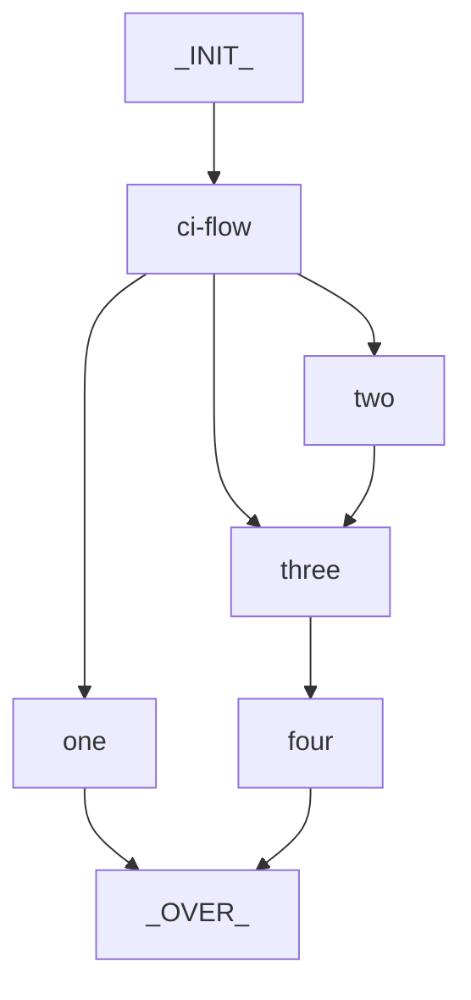

# tasker

task go next level

```mermaid
flowchart TB
    A_[_INIT_] --> ci-flow
    ci-flow --> one
    ci-flow --> two
    ci-flow --> three
    one --> Z_
    two --> three
    three --> four
    four --> Z_[_OVER_]
```
