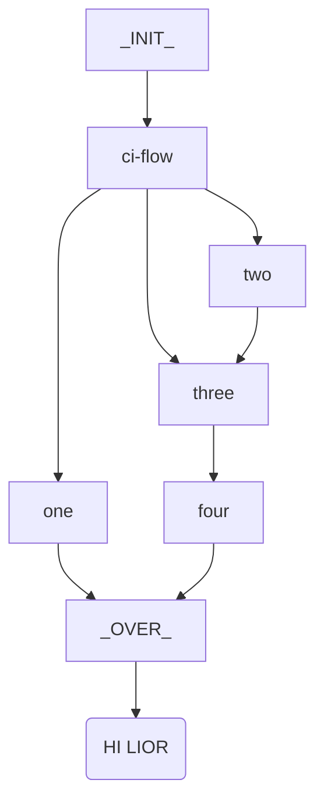

# tasker

## Dev Area

=== "C"
    SDF

=== "PY"
    DPDP

## Sample indented flowchart
???+ tip "sldkfj"

    ```mermaid
    flowchart TB
        A_[_INIT_] --> ci-flow
        ci-flow --> one
        ci-flow --> two
        ci-flow --> three
        one --> Z_
        two --> three
        three --> four
        four --> Z_[_OVER_]
        Z_ --> K("HI LIOR")
    ```

## Content

task go next level

