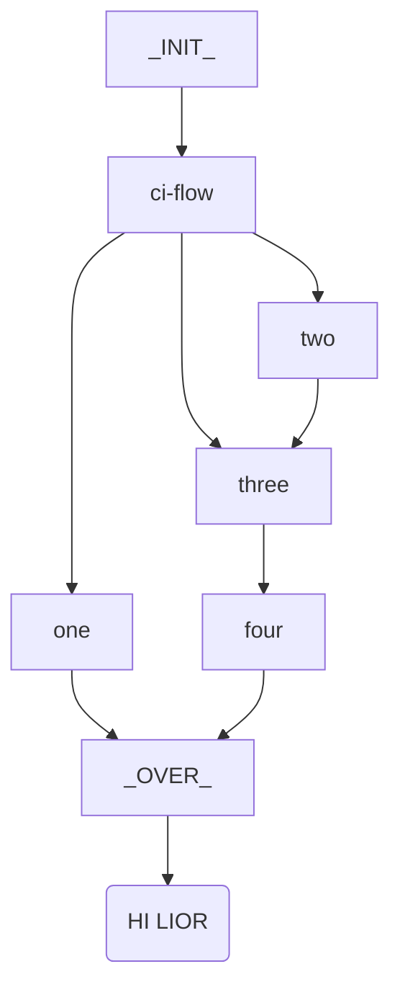

# Tasker


## Content

task go next level




**Tasker**  is a ui and analitics tool,
that works with taskfile configurations.

Sample Configurations can be found in

- [in this repo at ./tests/data](./tests/data)
- [in yd-tut-tasks](http://yairdar.github.io/ydu-tasfile-tut)

## Prerequisites

!!! tip "Basic Tools"
    We use [task go](http://taskfile.dev)

## Get Started

Create a dev environment

```bash
# To Create A dev/test environment
task venv-resolve

```
### Documentation

```bash
# To see documentation site in the browser run
task docs-builder:serve-source
```

### Data For Tests

- [sample taskfile](./tests/data/sample-task/Taskfile.yml)

## Dev Area

=== "C"
    SDF

=== "PY"
    DPDP

## Sample indented flowchart
???+ tip "sldkfj"

    !!! info "STam"
        - > - one
          > - two

    ```mermaid
    flowchart TB
        A_[_INIT_] --> ci-flow
        ci-flow --> one
        ci-flow --> two
        ci-flow --> three
        one --> Z_
        two --> three
        three --> four
        four --> Z_[_OVER_]
        Z_ --> K("HI LIOR")
    ```
