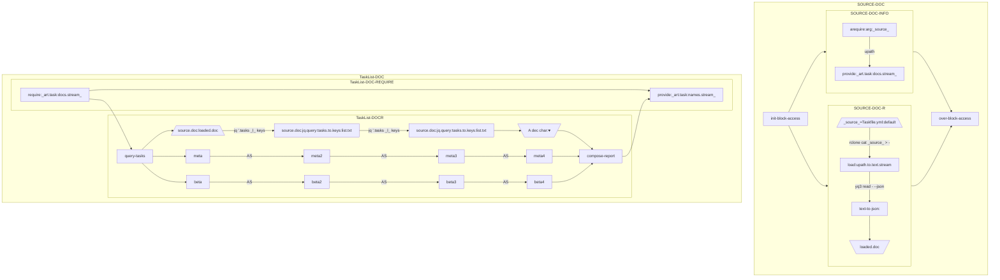

```yaml
 provide: art:loaded.doc
```


```mermaid
flowchart 
subgraph SOURCE-DOC

init-block-access --> SOURCE-DOC-INFO & SOURCE-DOC-R
SOURCE-DOC-INFO --> over-block-access
SOURCE-DOC-R --> over-block-access

subgraph SOURCE-DOC-INFO
 arequire:arg:_source_
 -->
 |upath|provide:_art.task:docs.stream_
end

subgraph SOURCE-DOC-R


source:upath[/_source_=Taskfile.yml:default\]
--> |rclone cat _source_ > -  | load:upath.to.text.stream 
--> |yq3 read - --json|text-to-json:
--> loaded.doc[\loaded.doc/]:::artifact_doc
classDef someclass fill:#f96;   
loaded.doc

end
end

subgraph TaskList-DOC

subgraph TaskList-DOC-REQUIRE

 
 require:_art.task:docs.stream_
    -->
 provide:_art.task:names.stream_
end

subgraph TaskList-DOCR
query-tasks
compose-report

require:_art.task:docs.stream_ --> query-tasks 
compose-report --> provide:_art.task:names.stream_ 

source.doc[/source.doc:loaded.doc\]
query-tasks --> source.doc
    --> |jq '.tasks _l_ keys|apply:jq.tasks[source.doc:jq.query:tasks.to.keys:list.txt]
    --> |jq '.tasks _l_ keys|apply:jq._list_[source.doc:jq.query:tasks.to.keys:list.txt]
    --> S[\"A dec char:#9829;"/]
--> compose-report

query-tasks --> meta 
--> 
|AS|meta2
--> 
|AS|meta3
--> 
|AS|meta4
--> compose-report

query-tasks --> beta 
--> 
|AS|beta2
--> 
|AS|beta3
--> 
|AS|beta4
--> compose-report

end
end
```


```
 provide:_art.task:docs.stream_
 ==>
 |bind|require:_art.task:docs.stream_
```